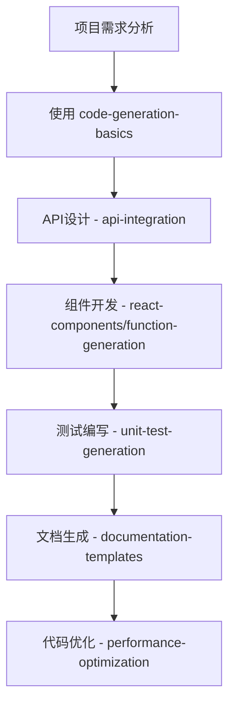
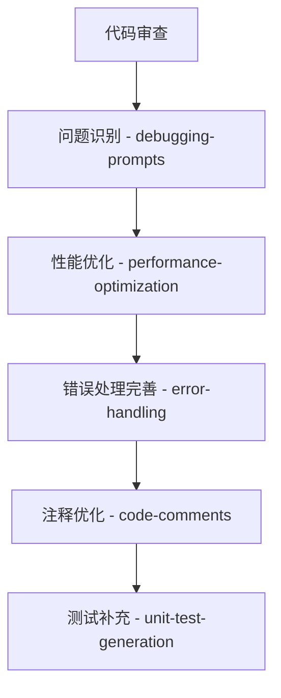

# GitHub Copilot 精通

## 概述

深入学习和掌握 GitHub Copilot 的使用技巧，通过系统化的学习路径和实用提示词库，全面提升编程效率和代码质量。本指南涵盖从基础入门到高级应用的完整学习体系。

## 🎯 学习路径

### 🌟 基础阶段 (入门必修)

- [x] Copilot 安装与配置
- [x] 基本快捷键和命令 (Ctrl+I, Tab, Alt+])
- [x] 代码补全基础用法
- [x] 注释驱动开发 (Comment-Driven Development)
- [x] 基础提示词应用 → [[../copilot-prompts/code-generation-basics]]

### 🚀 进阶阶段 (能力提升)

- [x] 上下文优化技巧
- [x] 复杂函数生成 → [[../copilot-prompts/function-generation]]
- [x] 测试代码生成 → [[../copilot-prompts/unit-test-generation]]
- [x] API集成开发 → [[../copilot-prompts/api-integration]]
- [x] 错误处理模式 → [[../copilot-prompts/error-handling]]

### 🎓 高级阶段 (专家级应用)

- [ ] 领域特定提示词设计
- [ ] 多文件上下文利用
- [ ] Copilot Chat 深度应用
- [ ] 自定义工作流集成
- [ ] 性能优化策略 → [[../copilot-prompts/performance-optimization]]
- [ ] 调试与诊断 → [[../copilot-prompts/debugging-prompts]]

## 🛠️ 核心技能矩阵

### 提示词工程 (Prompt Engineering)

#### 基础技巧
- **上下文设计**: 提供有效的代码上下文和相关文件结构
- **注释技巧**: 编写清晰描述性的注释来引导 Copilot
- **命名约定**: 使用具有语义的变量和函数名称
- **结构化思维**: 将复杂需求分解为清晰的步骤

#### 高级技巧
- **意图表达**: 通过注释明确表达编程意图和约束条件
- **示例驱动**: 提供输入输出示例来指导代码生成
- **模式识别**: 建立一致的代码模式让 Copilot 学习
- **上下文控制**: 管理多文件上下文的相关性

### 实践应用技巧

#### 开发流程优化
- **代码结构**: 保持清晰的项目组织和模块化设计
- **增量开发**: 逐步构建复杂功能，每步验证结果
- **模板复用**: 建立和维护个人/团队的代码模板库
- **质量控制**: 建立代码审查和测试的标准流程

#### 高效协作
- **团队规范**: 建立统一的提示词和注释标准
- **知识共享**: 维护团队级别的最佳实践文档
- **持续改进**: 定期评估和优化 Copilot 使用效果

## 📚 完整提示词库指南

### 🚀 代码生成类 (高频使用)

1. **[[../copilot-prompts/code-generation-basics]]** - 基础代码生成模板
   - 适用场景: 项目初始化、基础结构搭建
   - 技能等级: 入门必备 ⭐⭐⭐⭐⭐

2. **[[../copilot-prompts/function-generation]]** - 函数生成专用模板
   - 适用场景: 工具函数、业务逻辑、异步处理
   - 技能等级: 日常开发 ⭐⭐⭐⭐⭐

3. **[[../copilot-prompts/react-components]]** - React 组件生成
   - 适用场景: 前端组件开发、UI 构建
   - 技能等级: 前端专用 ⭐⭐⭐⭐⭐

4. **[[../copilot-prompts/api-integration]]** - API 集成代码生成
   - 适用场景: 后端服务集成、数据交互
   - 技能等级: 全栈开发 ⭐⭐⭐⭐⭐

### 🔧 代码优化类

5. **[[../copilot-prompts/performance-optimization]]** - 性能优化提示词
   - 适用场景: 代码重构、性能调优
   - 技能等级: 进阶应用 ⭐⭐⭐⭐⭐

6. **[[../copilot-prompts/code-comments]]** - 代码注释优化
   - 适用场景: 文档完善、代码维护
   - 技能等级: 基础必备 ⭐⭐⭐⭐⭐

### 🧪 测试与质量保证

7. **[[../copilot-prompts/unit-test-generation]]** - 单元测试生成
   - 适用场景: 测试驱动开发、质量保证
   - 技能等级: 进阶必备 ⭐⭐⭐⭐⭐

### 📚 文档生成

8. **[[../copilot-prompts/documentation-templates]]** - 文档模板生成
   - 适用场景: API 文档、项目说明、技术规范
   - 技能等级: 通用技能 ⭐⭐⭐⭐⭐

### 🐛 调试与问题解决

9. **[[../copilot-prompts/debugging-prompts]]** - 调试与问题诊断
   - 适用场景: 问题排查、性能分析、代码审查
   - 技能等级: 高级应用 ⭐⭐⭐⭐⭐

10. **[[../copilot-prompts/error-handling]]** - 错误处理与异常管理
    - 适用场景: 健壮性提升、异常处理、容错设计
    - 技能等级: 进阶必备 ⭐⭐⭐⭐⭐

### 💾 数据处理

11. **[[../copilot-prompts/database-queries]]** - 数据库查询优化
    - 适用场景: SQL 优化、ORM 使用、数据库设计
    - 技能等级: 后端专用 ⭐⭐⭐⭐⭐

## 🎯 实战应用场景

### 新项目开发工作流



### 代码质量提升工作流



## 💡 高级应用技巧

### Copilot Chat 深度使用

#### 代码解释与学习
```
请详细解释这段代码的工作原理，包括：
1. 核心算法逻辑
2. 时间和空间复杂度
3. 可能的优化点
4. 潜在的风险和边界情况

[代码片段]
```

#### 架构设计讨论
```
我需要设计一个 [具体场景] 的系统架构，请帮我：
1. 分析核心需求和约束
2. 推荐合适的技术栈
3. 设计模块划分和接口
4. 识别潜在的技术风险
```

### 多文件上下文利用

#### 项目结构优化
- 保持相关文件在同一目录
- 使用一致的命名约定
- 维护清晰的 import/export 关系
- 定期整理和重构项目结构

#### 上下文管理策略
- 在工作文件中包含相关的类型定义
- 保持相关函数和类在同一文件或相邻文件
- 使用描述性的文件和目录名称

## ✅ 最佳实践清单

### Do's ✅

#### 基础实践
- [x] 提供清晰的函数签名和参数说明
- [x] 使用描述性的变量名和函数名
- [x] 保持代码上下文的相关性和一致性
- [x] 定期验证和测试生成的代码

#### 高级实践
- [x] 建立个人/团队的提示词模板库
- [x] 使用版本控制跟踪提示词的演进
- [x] 定期评估和优化 Copilot 使用效果
- [x] 参与社区分享最佳实践

### Don'ts ❌

#### 安全与质量
- ❌ 不要完全依赖 Copilot 的建议，始终进行代码审查
- ❌ 不要在处理敏感数据的项目中暴露关键信息
- ❌ 不要跳过单元测试和集成测试
- ❌ 不要忽视代码的可读性和维护性

#### 效率误区
- ❌ 不要为了使用 Copilot 而过度复杂化简单问题
- ❌ 不要忽略团队的编码规范和最佳实践
- ❌ 不要过度依赖生成代码而忽视基础技能学习

## 📊 技能评估与进阶路径

### 当前水平评估

#### 初级水平 (Beginner)
- [ ] 能够熟练使用基础代码补全功能
- [ ] 掌握注释驱动的代码生成
- [ ] 理解基础提示词的使用方法
- [ ] 能够验证简单生成代码的正确性

#### 中级水平 (Intermediate)
- [x] 能够编写有效的自定义提示词
- [x] 熟练使用各类代码生成模板
- [x] 掌握上下文优化技巧
- [ ] 能够进行复杂的代码重构和优化

#### 高级水平 (Advanced)
- [ ] 掌握领域特定的提示词设计
- [ ] 能够设计团队级别的 Copilot 工作流
- [ ] 深度集成 Copilot Chat 到开发流程
- [ ] 能够培训和指导团队成员

### 进阶学习计划

#### 第一阶段 (基础巩固)
1. **完成所有基础提示词的实践** (1-2周)
   - 使用每个基础提示词完成实际项目
   - 记录使用心得和优化建议

2. **建立个人提示词库** (1周)
   - 基于个人开发习惯定制模板
   - 整理常用的代码片段和模式

#### 第二阶段 (能力提升)
1. **深入学习高级提示词** (2-3周)
   - 掌握性能优化和调试技巧
   - 学习错误处理和异常管理模式

2. **Copilot Chat 专项训练** (1-2周)
   - 练习复杂问题的分解和描述
   - 学习架构设计和代码审查技巧

#### 第三阶段 (专家级应用)
1. **工作流集成与优化** (2-4周)
   - 设计完整的开发工作流
   - 集成 CI/CD 和自动化测试

2. **团队协作与知识分享** (持续进行)
   - 制定团队 Copilot 使用规范
   - 定期分享最佳实践和经验

## 🔗 扩展资源

### 官方资源
- [GitHub Copilot 官方文档](https://docs.github.com/en/copilot)
- [Copilot Chat 使用指南](https://docs.github.com/en/copilot/github-copilot-chat)

### 社区资源
- GitHub Copilot 最佳实践社区
- 开发者经验分享博客
- 技术会议和研讨会资料

### 相关工具
- **模板库**: [[../templates/copilot-prompt]] - 创建新提示词的模板
- **快速指南**: [[../GETTING-STARTED]] - 项目快速上手指南
- **实践示例**: [[../daily-notes/]] - 日常使用实例记录

## 📈 效果追踪与评估

### 量化指标

#### 开发效率指标
- **代码生成准确率**: 目标 >85%
- **开发时间减少**: 目标 30-50%
- **代码审查通过率**: 目标 >90%
- **bug 率**: 相比手写代码不增加

#### 代码质量指标
- **测试覆盖率**: 维持或提升
- **代码复杂度**: 控制在合理范围
- **文档完整性**: 显著提升
- **团队协作效率**: 提升 20-30%

### 定期评估计划

#### 周度回顾
- [ ] 记录使用频率最高的提示词
- [ ] 总结遇到的问题和解决方案
- [ ] 更新个人提示词库

#### 月度总结
- [ ] 评估技能进步情况
- [ ] 更新学习计划和目标
- [ ] 分享经验和最佳实践

#### 季度规划
- [ ] 制定新的学习目标
- [ ] 评估工作流的改进效果
- [ ] 参与社区贡献和分享

---
*Created: 2024-01-20*  
*Tags: #github-copilot #ai-development #learning #skill-development*
