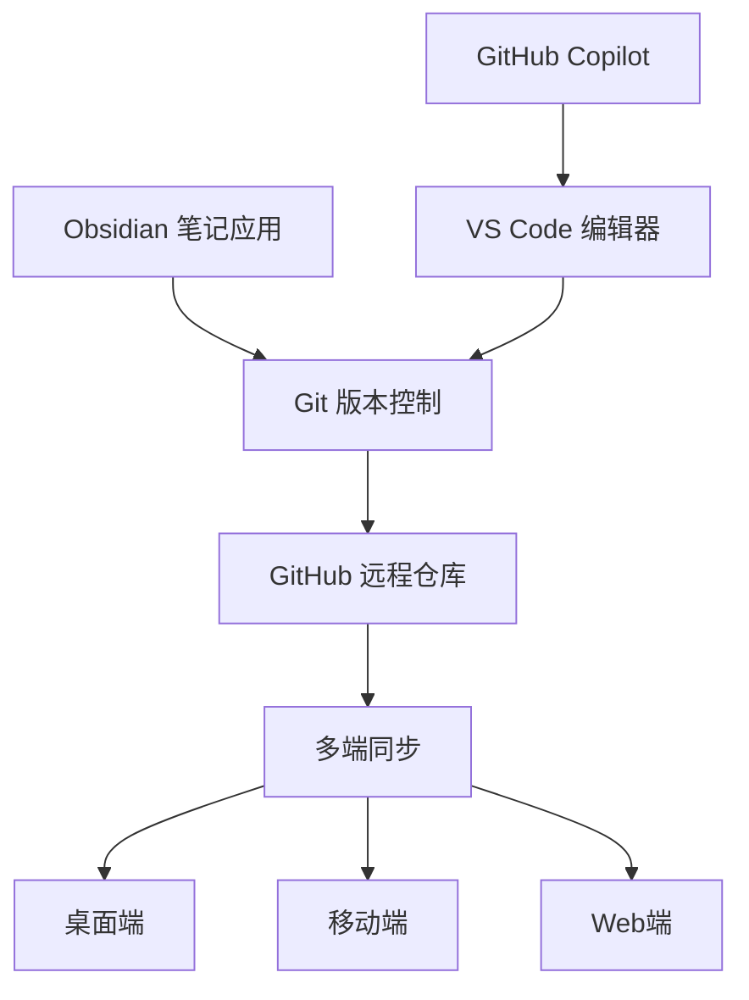

# 知识库优化项目

## 📋 项目概述
- **项目名称**: 知识库优化项目
- **开始时间**: 2024-03-15
- **负责人**: 开发团队
- **状态**: 🔄 进行中
- **优先级**: 🔴 高

## 🎯 项目目标

建立一套高效的个人/团队知识管理系统，整合 Obsidian、Git 和 VS Code 的优势，实现：

1. **统一的知识管理平台**
   - 标准化的笔记模板
   - 一致的文件组织结构
   - 自动化的索引生成

2. **高效的协作流程**
   - Git 版本控制
   - 多端同步支持
   - 团队协作规范

3. **智能写作辅助**
   - GitHub Copilot 集成
   - 代码片段和快捷键
   - 自动化脚本支持

## 📊 进度跟踪

### 第一阶段: 基础框架 (✅ 已完成)
- [x] Obsidian 基础配置
- [x] VS Code 工作区设置
- [x] 模板文件创建
- [x] 自动化脚本开发

### 第二阶段: 功能完善 (🔄 进行中)
- [ ] 移动端配置测试
- [ ] 团队协作流程设计
- [ ] 高级插件配置
- [ ] 性能优化

### 第三阶段: 推广应用 (⏳ 待开始)
- [ ] 用户培训材料
- [ ] 最佳实践文档
- [ ] 问题解决指南
- [ ] 社区反馈收集

## 📝 项目日志

### 2024-03-15
- ✅ 完成基础框架设计
- ✅ 创建核心配置文件
- ✅ 编写自动化脚本
- ✅ 生成示例文档

**下一步计划**: 测试移动端同步功能

## 🧠 想法和灵感

### 功能增强想法
1. **智能标签系统**: 基于内容自动建议标签
2. **知识图谱可视化**: 增强笔记间的关联展示
3. **AI 内容总结**: 利用 AI 自动生成笔记摘要
4. **多格式导出**: 支持 PDF、EPUB 等格式导出

### 集成优化
- 考虑集成 Notion API 进行数据同步
- 探索与 Anki 的联动进行知识复习
- 研究语音转文字的集成可能性

## 🔗 相关资源

- [Obsidian 官方文档](https://help.obsidian.md/)
- [GitHub Copilot 文档](https://docs.github.com/en/copilot)
- [VS Code Markdown 扩展](https://marketplace.visualstudio.com/items?itemName=yzhang.markdown-all-in-one)

## 📄 相关文档

- [[快速入门指南]]
- [[GitHub Copilot使用技巧]]
- [[团队协作规范]] (待创建)

## 🔧 技术架构

## 📈 成功指标

- **使用频率**: 每日笔记创建数量
- **同步效率**: Git 提交和推送的成功率
- **用户满意度**: 团队成员的反馈评分
- **功能利用率**: 各项功能的使用频次

## 🏁 项目总结

(项目完成后填写)

---
**标签**: #项目 #知识管理 #obsidian #vscode #git
**创建时间**: 2024-03-15 14:45
**预计完成**: 2024-04-15